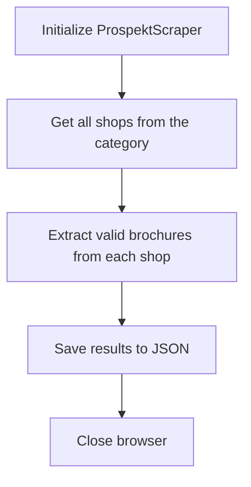

# Prospekt Scraper

A web scraper for prospektmaschine.de that collects brochure information from hypermarket category shops.

## Features

- Scrapes brochure data from multiple shops
- Filters outdated brochures
- Exports results to JSON format

## How It Works



## Installation

1. Clone the repository:
```bash
git clone https://github.com/xsporina/prospekt_scraper.git
cd prospekt_scraper
```

2. Create a virtual environment and activate it:
```bash
python -m venv venv
source venv/bin/activate  # On Windows: venv\Scripts\activate
```

3. Install dependencies:
```bash
pip install -r requirements.txt
```

4. Install Playwright browsers:
```bash
playwright install
```

## Usage

Run the scraper:
```bash
python main.py
```

The results will be saved to `output/output.json`.

## Project Structure

```
PROSPEKT_SCRAPER/
├── app/                # Main application code
├── models/             # Data models
├── utils/              # Utility functions
└── output/             # Output directory
```

## License

[MIT](LICENSE)